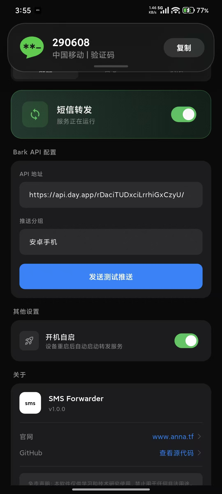
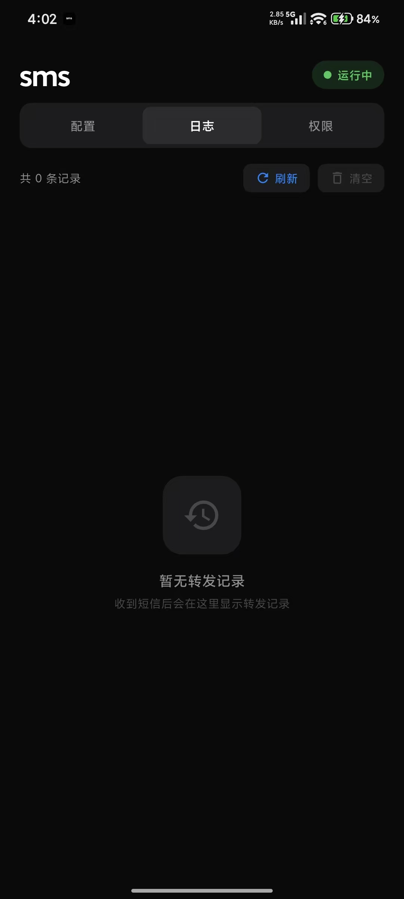
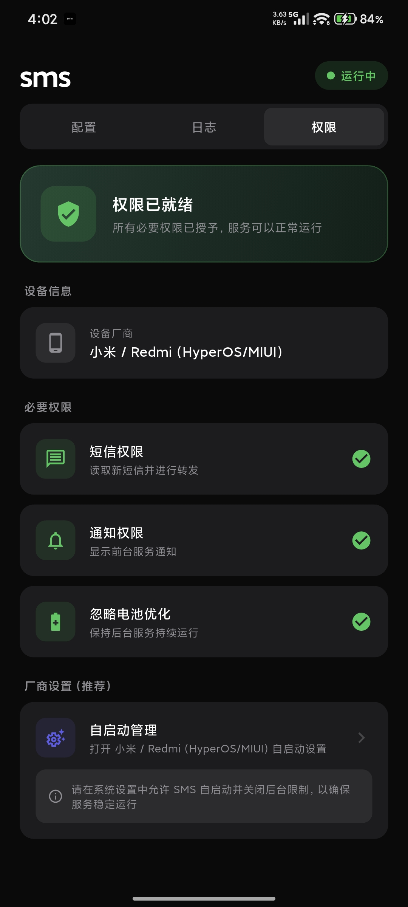

# SMS Forwarder

<p align="center">
  
</p>

<p align="center">
  <strong>Android 短信转发工具 - 将短信实时推送到 Bark</strong>
</p>

<p align="center">
  <a href="https://www.anna.tf">官网</a> •
  <a href="#功能特性">功能</a> •
  <a href="#截图">截图</a> •
  <a href="#安装">安装</a> •
  <a href="#使用说明">使用</a> •
  <a href="#免责声明">免责声明</a>
</p>

---

## 功能特性

- **实时短信转发** - 收到短信后自动推送到 Bark
- **后台常驻运行** - 前台服务保证稳定运行
- **开机自启** - 设备重启后自动启动服务
- **多厂商适配** - 支持小米 HyperOS、华为、OPPO、vivo、一加、三星等
- **简约黑色设计** - 现代化暗色主题 UI
- **隐私保护** - 数据仅在本地处理，不上传任何服务器

## 截图

<p align="center">
  
  
  
</p>

## 技术架构

### 前端 (Flutter)
- **框架**: Flutter 3.x
- **语言**: Dart
- **状态管理**: StatefulWidget
- **本地存储**: SharedPreferences
- **HTTP**: http 包

### 后端 (Android Native)
- **语言**: Kotlin
- **短信监听**: BroadcastReceiver + ContentObserver（双重机制）
- **后台服务**: Foreground Service
- **开机自启**: BootReceiver

### 项目结构

```
sms/
├── lib/
│   ├── main.dart                 # 应用入口 + 条款同意页
│   ├── screens/
│   │   └── home_screen.dart      # 主页面（Tab 切换）
│   ├── services/
│   │   ├── permission_service.dart  # 权限管理
│   │   └── settings_service.dart    # 设置和日志管理
│   └── widgets/
│       ├── config_section.dart      # 配置页面
│       ├── log_section.dart         # 日志页面
│       └── permission_section.dart  # 权限页面
├── android/
│   └── app/src/main/kotlin/.../
│       ├── MainActivity.kt          # 主 Activity
│       ├── SmsForwarderService.kt   # 前台服务 + 短信监听
│       ├── SmsReceiver.kt           # 短信广播接收器
│       └── BootReceiver.kt          # 开机自启接收器
└── screenshots/                     # 截图
```

## 安装

### 方式一：下载 APK

从 [Releases](https://github.com/crispvibe/Android-SMS-Forwarding-iOS/releases) 页面下载最新 APK 安装。

### 方式二：源码编译

```bash
# 克隆仓库
git clone https://github.com/crispvibe/Android-SMS-Forwarding-iOS.git
cd Android-SMS-Forwarding-iOS

# 安装依赖
flutter pub get

# 编译 APK
flutter build apk --release
```

编译产物位于 `build/app/outputs/flutter-apk/app-release.apk`

## 使用说明

### 1. 首次启动

首次打开应用需要同意用户协议和免责声明。

### 2. 配置 Bark API

1. 在 iOS 设备上安装 [Bark](https://apps.apple.com/app/bark-customed-notifications/id1403753865)
2. 打开 Bark 获取推送 URL（如：`https://api.day.app/your_key`）
3. 在 SMS Forwarder 配置页面填入 API 地址
4. 点击「发送测试推送」验证配置

### 3. 授予权限

在「权限」页面授予以下权限：

| 权限 | 用途 |
|------|------|
| 短信权限 | 读取新短信 |
| 通知权限 | 显示前台服务通知 |
| 忽略电池优化 | 保持后台运行 |

### 4. 小米/HyperOS 额外设置

小米设备需要额外开启「通知类短信」权限：

**设置 → 应用设置 → 应用管理 → SMS → 权限管理 → 通知类短信 → 允许**

### 5. 启用转发

在配置页面打开「短信转发」开关，状态变为「运行中」即可。

## 支持的厂商

| 厂商 | 系统 | 支持状态 |
|------|------|---------|
| 小米 | HyperOS / MIUI | ✅ 完全支持 |
| Redmi | HyperOS / MIUI | ✅ 完全支持 |
| 华为 | HarmonyOS / EMUI | ✅ 支持 |
| 荣耀 | MagicOS | ✅ 支持 |
| OPPO | ColorOS | ✅ 支持 |
| vivo | OriginOS | ✅ 支持 |
| 一加 | OxygenOS | ✅ 支持 |
| 三星 | One UI | ✅ 支持 |
| 其他 | 原生 Android | ✅ 支持 |

## 依赖

```yaml
dependencies:
  flutter: sdk
  http: ^1.2.0
  shared_preferences: ^2.2.2
  permission_handler: ^11.3.0
  url_launcher: ^6.2.4
```

## 开源许可

本项目采用 [MIT License](LICENSE) 开源许可证。

```
MIT License

Copyright (c) 2026 anna.tf

Permission is hereby granted, free of charge, to any person obtaining a copy
of this software and associated documentation files (the "Software"), to deal
in the Software without restriction, including without limitation the rights
to use, copy, modify, merge, publish, distribute, sublicense, and/or sell
copies of the Software, and to permit persons to whom the Software is
furnished to do so, subject to the following conditions:

The above copyright notice and this permission notice shall be included in all
copies or substantial portions of the Software.

THE SOFTWARE IS PROVIDED "AS IS", WITHOUT WARRANTY OF ANY KIND, EXPRESS OR
IMPLIED, INCLUDING BUT NOT LIMITED TO THE WARRANTIES OF MERCHANTABILITY,
FITNESS FOR A PARTICULAR PURPOSE AND NONINFRINGEMENT. IN NO EVENT SHALL THE
AUTHORS OR COPYRIGHT HOLDERS BE LIABLE FOR ANY CLAIM, DAMAGES OR OTHER
LIABILITY, WHETHER IN AN ACTION OF CONTRACT, TORT OR OTHERWISE, ARISING FROM,
OUT OF OR IN CONNECTION WITH THE SOFTWARE OR THE USE OR OTHER DEALINGS IN THE
SOFTWARE.
```

## 免责声明

> ⚠️ **重要声明**

1. **仅供学习研究** - 本软件仅供学习和技术研究使用，严禁用于任何非法用途。

2. **合法合规使用** - 用户应确保在合法合规的前提下使用本软件，遵守当地法律法规。

3. **内容责任** - 使用本软件转发的短信内容由用户自行负责，开发者不对任何内容承担责任。

4. **隐私保护** - 本软件不会收集、存储或传输用户的任何个人数据到第三方服务器。所有数据仅在用户设备本地处理。

5. **风险自担** - 用户使用本软件所产生的一切后果由用户自行承担，开发者不承担任何法律责任。

6. **禁止违法** - 禁止将本软件用于：
   - 侵犯他人隐私
   - 诈骗活动
   - 骚扰行为
   - 窃取验证码
   - 其他任何违法活动

7. **协议同意** - 继续使用本软件即表示您已阅读、理解并同意以上所有条款。

**如果您不同意以上条款，请立即停止使用并删除本软件。**

## 联系

- **官网**: [www.anna.tf](https://www.anna.tf)
- **GitHub**: [crispvibe/Android-SMS-Forwarding-iOS](https://github.com/crispvibe/Android-SMS-Forwarding-iOS)

---

<p align="center">
  <sub>© 2026 anna.tf. All rights reserved.</sub>
</p>
